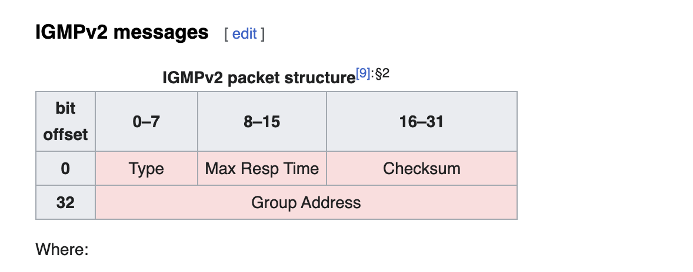

## IGMP

The Internet Group Management Protocol (IGMP) is a protocol that allows several devices to share one IP address so they can all receive the same data. Specifically, IGMP allows devices to join a multicasting group. 

## Multicasting

Multicasting is when a group of devices all receive the same messages or packets. Multicasting works by sharing an IP address between multiple devices. Any network traffic directed at that IP address will reach all devices that share the IP address, instead of just one device. 

下面这个视频讲的很好:



## How does IGMP work?

看完视频对 IGMP 大致过程应该有了了解了, 接下来继续看理论:

A router that supports IGMP listens to IGMP transmissions from devices in order to figure out which devices belong to which multicast groups.

IGMP uses IP addresses that are set aside for multicasting. Multicast IP addresses are in the range between 224.0.0.0 and 239.255.255.255. (In contrast, anycast networks can use any regular IP address.) Each multicast group shares one of these IP addresses. When a router receives a series of packets directed at the shared IP address, it will duplicate those packets, sending copies to all members of the multicast group. 

**IGMP multicast groups can change at any time. A device can send an IGMP "join group" or "leave group" message at any point.** 

IGMP works directly on top of the Internet Protocol (IP). Each IGMP packet has both an IGMP header and an IP header. **Just like ICMP, IGMP does not use a transport layer protocol such as TCP or UDP**.

## What types of IGMP messages are there?

- IGMP General Membership Query (MQ) messages are **sent by multicast routers** to its connected subnets to identify the [multicast groups](https://www.omnisecu.com/tcpip/what-is-multicast-group.php) which the multicast clients in the network are interested to subscribe. General Membership Query (MQ) messages are sent by multicast router to the computers on its subnet at link-local All systems multicast address 224.0.0.1. 

- IGMP Group-specific Multicast Query (MQ) messages are sent to a specific multicast groupaddress as the destination IPv4 address. Group-specific Multicast Query (MQ) messages are used to determine the members of a particular multicast group. 

- IGMP Membership Report messages are **sent by multicast clients** inside the subnet to the router to inform the intention to join a multicast group or in response to a Membership Query (MQ) message sent by the router.
- Leave Group (LG) messages are **sent by multicast clients** to local multicast routers to inform that they are no longer interested in traffic from a particular group.

> A **multicast group** is a group of computers (more specifically, network interfaces) interested in receiving a particular stream of data. Multicast groups does not require to be located in a local network segment. Multicast groups can be located in any different network segments connected together with routers those can forward multicast traffic. Computers can join a multicast group or leave a multicast group using a protocol called as IGMP (Internet Group Management Protocol).

看一下 IGMPV2 Message Format, 

该信息中的 Group Address Field 解释如下: 

注意上面提到的 IP destination address 并不是放到 IGMP Message 里的 Group Address Field 不是一个东西, 

## 抓包分析

参考:

- [What is IGMP? | Internet Group Management Protocol | Cloudflare](https://www.cloudflare.com/learning/network-layer/what-is-igmp/)
- https://youtu.be/W5oMvrMRM3Q
- [IGMP基础 | 曹世宏的博客](https://cshihong.github.io/2018/02/12/IGMP%E5%9F%BA%E7%A1%80/)
- [What is multicast group](https://www.omnisecu.com/tcpip/what-is-multicast-group.php)
- [IGMP message types](https://www.omnisecu.com/tcpip/igmp-message-types.php)
- [Internet Group Management Protocol](https://en.wikipedia.org/wiki/Internet_Group_Management_Protocol)